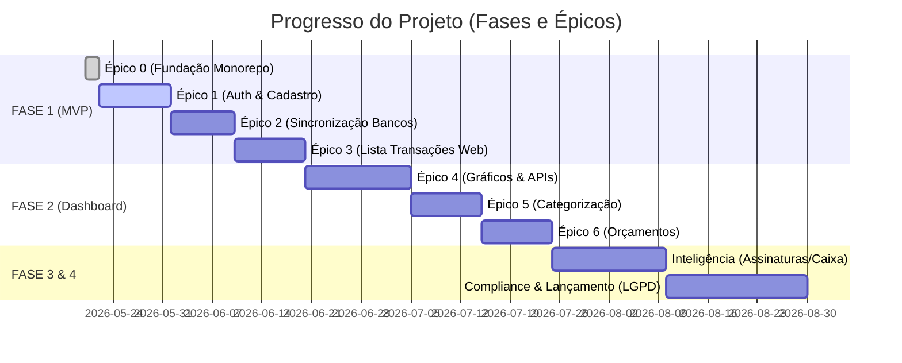

# Relatório de Status — Dashboard Open Finance 📊

Este relatório apresenta o andamento atual do desenvolvimento do **Dashboard Open Finance (Nexo Finance / FinDash)**, detalhando os marcos já alcançados, a arquitetura em vigor, o status do protótipo e o roadmap das tarefas pendentes.

---

## 📈 Status Geral do Projeto

O projeto encontra-se em transição entre a **Fundação da Infraestrutura & Autenticação (Épicos 0 e 1)** e a **Sincronização de Dados Reais & Portabilidade do Protótipo (Épicos 2 e 3)**.

---

## ✅ O Que Já Está Pronto?

### 1. Fundação & Infraestrutura (Épico 0)
- **Estrutura de Monorepo**: Configurado com **Turborepo** e **pnpm workspaces** para compartilhamento ideal de dependências e builds rápidos.
- **Banco de Dados Local**: Ambiente dockerizado com **PostgreSQL 15** e **Redis 7** funcional.
- **Modelagem ORM (Prisma)**: Implementadas todas as **16 tabelas** do banco relacional, incluindo isolamento multi-tenant orientado a `workspaces`, suporte a chaves criptografadas (AES-256) e estrutura para cartões de crédito/contas.
- **Políticas de Acesso (RLS)**: Preparadas no banco de dados para garantir isolamento absoluto por usuário e workspace.

### 2. Autenticação & Cadastro Robusto (Épico 1)
- **Integração Supabase**: Login e fluxo de autenticação baseados em JWT com middleware de proteção de rotas no Next.js.
- **Fluxo Completo de Cadastro (`/cadastro`)**:
  - Campos completos de identificação, e-mail, telefone e documento.
  - **Validador matemático customizado de CPF e CNPJ** client-side (com algoritmo de validação de dígitos reais, não apenas regex).
  - **Indicador dinâmico de força de senha** (barra colorida com feedback visual em tempo real).
  - Máscaras dinâmicas de campos de texto e toggle de visibilidade de senha.
- **Fluxo de Integração de Dados**:
  - Rota `GET /api/users/me` no backend Fastify que realiza o **auto-provisionamento automático** do primeiro Workspace do usuário (`Meu Dashboard`) no momento do primeiro login, criando o vínculo de permissões.

### 3. Protótipo Interativo Funcional (`apps/prototype`)
Um protótipo avançado construído em Vite + TypeScript serve como modelo estético e funcional de UI/UX:
- **Design Estético Premium (SaaS Dark Glassmorphism)**: Efeito de desfoque translúcido (`backdrop-filter`), cards KPIs modernos com micro-animações, gradientes premium e paleta harmônica adaptada a interfaces financeiras.
- **Dashboard de Gráficos (ECharts)**: Exibição visual de receitas vs despesas, gráficos rosca de distribuição de categorias e projeções.
- **Motor de Importação CSV/Excel**:
  - Algoritmo inteligente com limpeza automática de base.
  - Detecção e descarte silencioso de duplicidades e linhas estruturalmente inválidas (ex: linhas de rodapés/resumos ou transferências internas).
  - Associação de transações a contas específicas (ex: Nubank, Caixa) na importação.
- **Simulações de UI**: Aba de Configurações, Perfil dinâmico com persistência local e cartão de crédito VISA virtual.

---

## 🛠️ O Que Falta Fazer? (Roadmap de Implementação)

Para levar a aplicação do protótipo estático para o sistema real Next.js/Fastify, devemos seguir os seguintes passos divididos em fases:

### 🚀 FASE 1 — Finalização do MVP (Próximos Passos Imediatos)
1. **Portabilidade do Layout e Componentes**:
   - Migrar o design estético de vidro escuro (`style.css` do protótipo) para os componentes React/Tailwind no Next.js (`apps/web`).
   - Criar as páginas reais protegidas no Next.js (`/` ou `/dashboard`, `/transactions`, `/connections`, `/settings`).
2. **Integração do Agregador BaaS (Open Finance)**:
   - Configurar o SDK de um agregador (ex: Belvo, Pluggy ou Klavi) para estabelecer conexões bancárias OAuth reais.
   - Implementar webhooks de escuta para sincronização em background.
3. **Conexão Real do Front-End com Fastify**:
   - Conectar as rotas de transações e contas do Next.js à API Fastify (`services/api`) usando o Prisma Client para puxar dados diretamente do PostgreSQL em vez de usar Mock/LocalStorage.
   - Criar a listagem de transações com **virtualização** (para suportar mais de 10 mil linhas sem perda de performance em celulares Moto G).

### 📊 FASE 2 — Inteligência e Métricas do Dashboard
1. **Visualizações Gráficas Dinâmicas**:
   - Integrar o Apache ECharts dentro do Next.js consumindo dados agregados da API.
   - Configurar cacheamento via **Redis** na API para carregamento instantâneo.
2. **Motor de Categorização**:
   - Implementar o backend de regras para categorização automatizada de gastos.
3. **Gestão de Orçamentos**:
   - CRUD de limites orçamentários por categoria e alertas automáticos de estouro de limites (via `BudgetAlertJob`).

### 🧠 FASE 3 & 4 — Recursos Avançados & Compliance
1. **Detecção de Assinaturas (BullMQ)**:
   - Configuração do job diário `DetectRecurringJob` para agrupar transações que ocorrem em ciclos (ex: Netflix, Spotify) com margem de ±5% no valor.
2. **Projeções de Caixa**:
   - Implementação do algoritmo de média móvel para gerar o gráfico de fluxo de caixa futuro de 30/90 dias (`ForecastJob`).
3. **Privacidade (LGPD)**:
   - Painel para o usuário exportar todos os dados pessoais em JSON ou solicitar a exclusão total da conta, escrevendo as trilhas de auditoria imutáveis na tabela `tb_audit_log`.

---

## 📋 Resumo das Frentes de Trabalho Pendentes

| Componente | Status Atual | Próximo Passo Necessário |
| :--- | :---: | :--- |
| **Infra & DB** | 🟢 Pronto | Nenhum (Monitorar performance dos índices) |
| **Auth & Cadastro** | 🟢 Pronto | Integrar MFA na autenticação (opcional para o MVP) |
| **Design Visual (Web)** | 🟡 Prototipado | Portar estilos glassmorphism para Next.js / Tailwind |
| **Módulo de Transações** | 🔴 Pendente | Criar APIs de listagem/busca de transações reais no Fastify |
| **Sincronização Bancária** | 🔴 Pendente | Configurar chaves da API do Agregador Open Finance |
| **Gráficos ECharts (Web)** | 🟡 Prototipado | Integrar bibliotecas em componentes React |
| **Fila de Background (BullMQ)**| 🔴 Pendente | Inicializar a pasta `services/workers` com jobs Redis |

---

> [!NOTE]
> Toda a base estrutural e arquitetônica de software está 100% pronta e com build validada. A fundação de banco de dados e autenticação foi totalmente testada e suporta multitenancy nativo de workspaces de forma segura.
